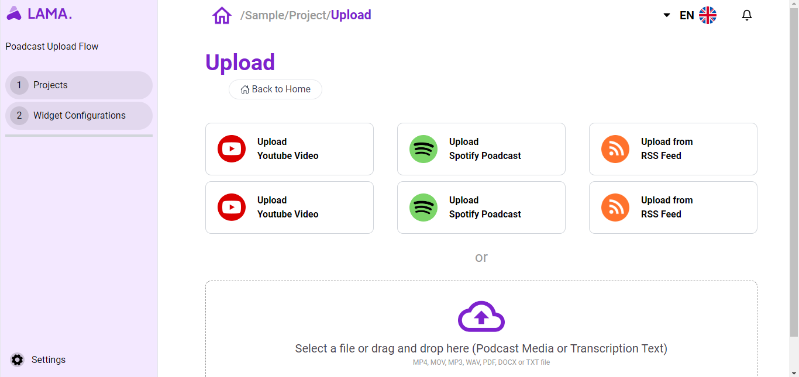
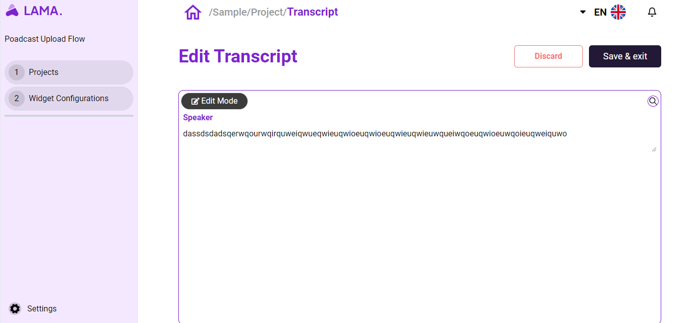
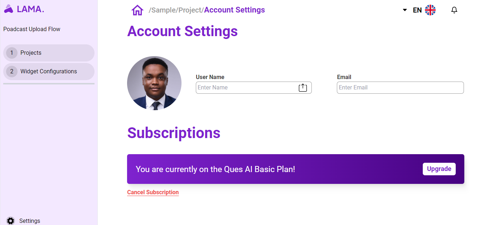

# zura_ventures_coding_assignment

### Introduction 
LAMA is committed to providing podcasters with a streamlined, efficient, and enjoyable platform. Join us on this journey, and let's elevate the podcasting experience together!

### Prerequisites
- Node.js and npm installed on your machine.
- MongoDB installed locally or accessible remotely.

## Tech Stack

The LAMA Podcast Platform is built using the MERN stack:

- **MongoDB:** NoSQL database for storing podcast data.
- **Express:** Web framework for building scalable server applications.
- **React:** JavaScript library for building user interfaces.
- **Node.js:** JavaScript runtime for server-side development.

## Features

#### Landing Page

The landing page serves as the gateway to the LAMA Podcast Platform. It's designed to captivate visitors and provide a glimpse into the world of seamless podcasting.

#### ProjectListsPage
The Project Lists Page is where podcasters can manage and organize their projects. It provides an overview of all ongoing and completed podcast episodes, allowing for easy navigation and quick access to essential information.

#### Upload
Uploading podcast content is a breeze with our intuitive Upload feature. Podcasters can effortlessly share their episodes with the world by uploading audio files, adding descriptions, and customizing metadata.

#### Sample Project

Explore a Sample Project to get a feel for how your podcast could look on the LAMA platform. This feature allows users to preview and understand the layout and presentation of their content.

#### Edit Transcript
The Edit Transcript feature empowers podcasters to refine and perfect their episode transcripts. 

#### Profile Account
Manage your account seamlessly through the Profile Account page. Update personal information, customize preferences, and keep track of your podcasting journey—all in one place.

## Getting Started
To start exploring and contributing to the LAMA Podcast Platform, follow these steps:

### Installation

1. **Clone the Repository:**
   
   - git clone https://github.com/your-username/zura_ventures_coding_assignment.git
   
   - Navigate to the Frontend Directory:
       - cd zura_ventures_coding_assignment/frontend

   - Install Dependencies:
        - npm install

2. **Running the Application**

  - Start the Backend (Node.js and Express):
     - cd ../backend
     - npm install
     - npm start

  - Start the Frontend (React):
     - cd ../frontend
     - npm start

##### Happy coding! 🚀